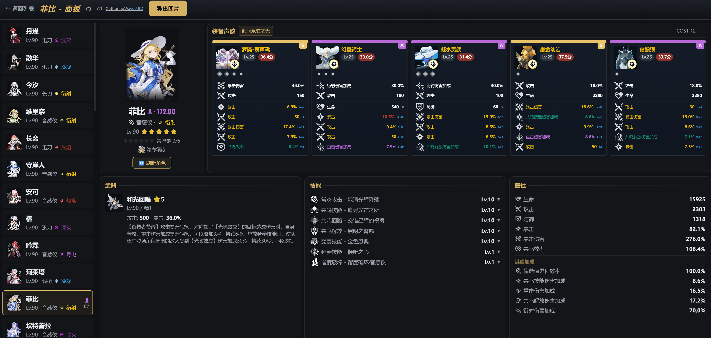

# WuwaWebTool

鸣潮（Wuthering Waves）角色面板 Web 查看器 — 将 [XutheringWavesUID](https://github.com/Loping151/XutheringWavesUID) 从 GsuidCore 机器人框架中剥离为独立 Web 服务，无需部署 NoneBot/GsuidCore 环境，通过浏览器即可查询角色面板、声骸评分等信息。

## 预览

<table>
<tr>
<td width="50%"></td>
<td width="50%"></td>
</tr>
<tr>
<td align="center"><b>角色列表页</b> — 按评分/等级/属性排序，已访问角色自动缓存评分</td>
<td align="center"><b>角色详情面板</b> — 声骸评分、技能、武器、属性一览</td>
</tr>
</table>

## 功能

- **库街区登录** — 支持手机号+验证码登录
- **角色列表** — 查看所有已解锁角色，按评分/等级/属性排序和搜索
- **角色面板** — 查看角色详情：属性、武器、技能、共鸣链、皮肤
- **声骸评分** — 每个声骸独立评分（SSS ~ C），副词条权重着色，套装效果展示
- **按需加载** — 仅在点击角色时请求详情和评分，本地缓存避免重复请求
- **单角色刷新** — 面板内一键刷新当前角色的数据
- **导出图片** — 将角色面板导出为 PNG 图片

## 技术栈

| 层 | 技术 |
|----|------|
| 后端 | Python FastAPI + uvicorn |
| 前端 | 原生 HTML/CSS/JS（无框架） |
| 评分引擎 | XutheringWavesUID 编译模块（.pyd） |
| 缓存 | 前端 localStorage + 后端 SQLite |

## 快速开始

### 本地运行

```bash
cd backend
pip install -r requirements.txt
python main.py
```

启动后访问 `http://localhost:8000`，首次启动会自动从 CDN 下载游戏资源和评分模块。

### 环境变量

| 变量 | 说明 | 默认值 | 示例 |
| --- | --- | --- | --- |
| `PORT` | 服务监听端口 | `8000` | `PORT=3000` |
| `WUWA_DATA_PATH` | 数据目录（资源、缓存、构建文件） | `backend/data` | `WUWA_DATA_PATH=/data/wuwa` |
| `WUWA_LOCAL_PROXY_URL` | 本地代理地址（国内网络访问 Kuro API） | 空（直连） | `WUWA_LOCAL_PROXY_URL=http://127.0.0.1:7890` |
| `WUWA_NEED_PROXY_FUNC` | 需要走代理的函数列表（逗号分隔），`all` 表示全部 | 空 | `WUWA_NEED_PROXY_FUNC=all` |
| `WUWA_KURO_URL_PROXY_URL` | Kuro API 反代地址（直连失败时使用） | 空（用官方 API） | `WUWA_KURO_URL_PROXY_URL=https://proxy.example.com` |
| `WUWA_CACHE_EVERYTHING` | 是否缓存所有数据 | `false` | `WUWA_CACHE_EVERYTHING=true` |
| `WUWA_HIDE_UID` | 是否隐藏游戏 UID | `false` | `WUWA_HIDE_UID=true` |

> 所有 `WUWA_*` 变量会覆盖 `config.json` 中的对应配置。Docker 部署时通过 `-e` 或 `environment` 传入即可。
>
> 国内用户如果 Kuro API 连接不稳定，建议配置 `WUWA_LOCAL_PROXY_URL` 和 `WUWA_NEED_PROXY_FUNC=all` 通过代理访问。

### Docker

**预构建镜像（推荐）：**

```bash
docker pull ghcr.io/eventhorizonsky/wuwawebtool:latest
docker run -p 8000:8000 \
  -v wuwa-data:/app/backend/data \
  ghcr.io/eventhorizonsky/wuwawebtool:latest
```

**本地构建：**

```bash
docker build -f backend/Dockerfile -t wuwawebtool .
docker run -p 8000:8000 -v wuwa-data:/app/backend/data wuwawebtool
```

### Docker Compose

```yaml
# docker-compose.yml
services:
  wuwawebtool:
    image: ghcr.io/eventhorizonsky/wuwawebtool:latest
    ports:
      - "8000:8000"
    volumes:
      - wuwa-data:/app/backend/data
    restart: unless-stopped

volumes:
  wuwa-data:
```

```bash
docker compose up -d
```

> **数据持久化**：`/app/backend/data` 目录存放 CDN 下载的游戏资源和评分模块（.pyd），不映射的话每次容器重建都会重新下载（~数百 MB）。映射到宿主机卷或目录后，后续启动只需增量检查，秒级完成。

### 免费平台部署

项目可部署到以下托管平台：

**Render**（免费套餐含 1 个 Web 服务）— Fork 本仓库后，在 [Render Dashboard](https://dashboard.render.com) 选择 "Blueprint"，自动读取 `render.yaml` 完成部署。

> Render 免费套餐不含持久磁盘，每次重新部署会重新下载资源（启动时自动完成，增量检查 + CDN 加速）。

**Fly.io**（免费套餐含 3 个 256MB VM + 3GB 持久卷）— 推荐方案：

```bash
# 安装 flyctl 后
fly launch --dockerfile backend/Dockerfile
fly volumes create wuwa_data --size 1 --region <your-region>
```

然后在生成的 `fly.toml` 中添加卷挂载：

```toml
[mounts]
  source = "wuwa_data"
  destination = "/app/backend/data"
```

```bash
fly deploy
```

**Koyeb**（免费套餐含 1 个 Nano 实例）— 在 [Koyeb Dashboard](https://app.koyeb.com) 选择 "Deploy from GitHub"，指定 Dockerfile 路径 `backend/Dockerfile` 即可。

**Docker Compose 自托管**（如果你有一台 VPS 或家庭服务器）：

```bash
docker compose up -d
```

> 以上平台的资源下载均为增量模式：首次部署全量下载，后续重启秒级跳过已有文件。持久卷可保留数据避免重复下载。

## 项目结构

```
WuwaWebTool/
├── frontend/           # 前端静态页面
│   ├── index.html      # 角色列表页
│   ├── panel.html      # 角色面板详情页
│   ├── css/style.css   # 样式
│   └── js/api.js       # API 客户端 & 缓存逻辑
├── backend/
│   ├── main.py         # FastAPI 入口
│   ├── api/            # API 路由（auth, game_data, score）
│   ├── core/           # 核心逻辑（评分、缓存、资源下载）
│   └── login_pages/    # 登录页面模板
└── README.md
```

## 致谢

本项目修改自 **[Loping151/XutheringWavesUID](https://github.com/Loping151/XutheringWavesUID)**。

衷心感谢原项目作者 [Loping151](https://github.com/Loping151) 以及 XutheringWavesUID 社区的贡献以及提供的CDN服务。

本项目将原 GsuidCore 插件改造为独立 Web 服务，前端从 Pillow 渲染图改为纯 HTML/CSS 展示，并优化了缓存策略以减少对官方 API 的请求频率。
